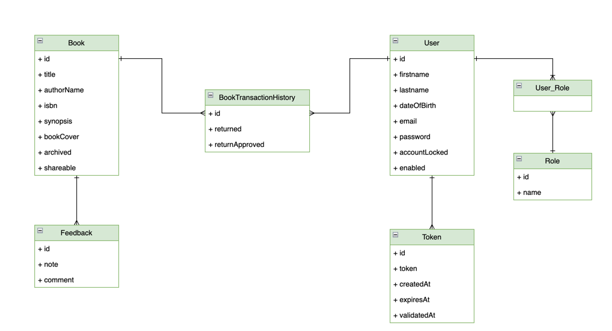
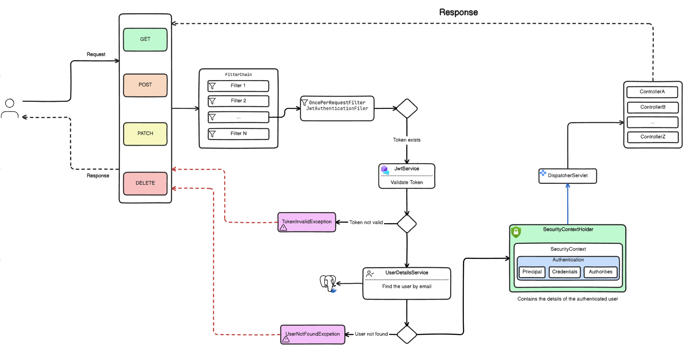
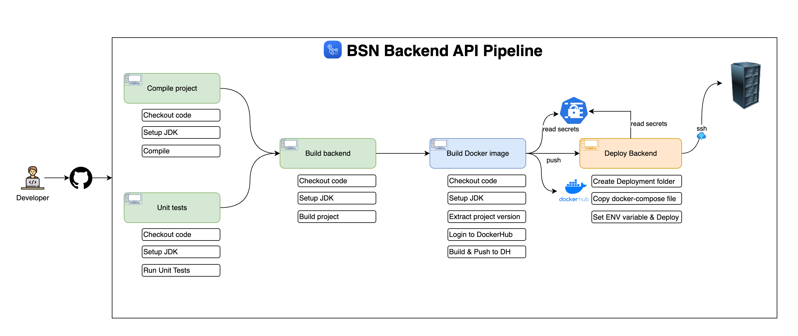
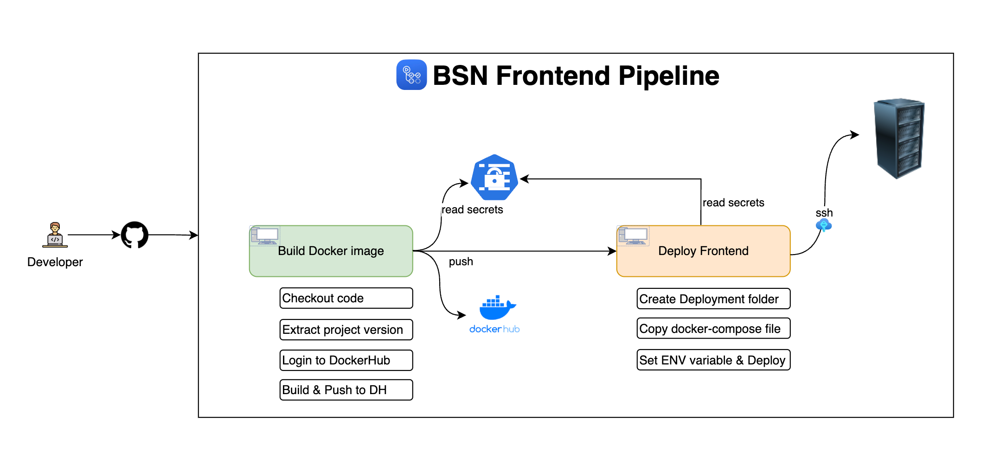

# Book Social Network

## Table of Contents

- [Overview](#overview)
- [Features](#features)
- [Technologies Used](#technologies-used)
    - [Backend (book-social-network)](#backend-book-social-network)
    - [Frontend (book-social-network-ui)](#frontend-book-social-network-ui)
- [Learning Objectives](#learning-objectives)
- [License](#license)
- [Getting Started](#getting-started)
- [Contributors](#contributors)
- [Acknowledgments](#acknowledgments)

## Overview

Book Social Network is a full-stack application that enables users to manage their book collections and engage with a community of book enthusiasts. It offers features such as user registration, secure email validation, book management (including creation, updating, sharing, and archiving), book borrowing with checks for availability, book return functionality, and approval of book returns. The application ensures security using JWT tokens and adheres to best practices in REST API design. The backend is built with Spring Boot 3 and Spring Security 6, while the frontend is developed using Angular with Bootstrap for styling.

## Features

- User Registration: Users can register for a new account.
- Email Validation: Accounts are activated using secure email validation codes.
- User Authentication: Existing users can log in to their accounts securely.
- Book Management: Users can create, update, share, and archive their books.
- Book Borrowing: Implements necessary checks to determine if a book is borrowable.
- Book Returning: Users can return borrowed books.
- Book Return Approval: Functionality to approve book returns.

#### Class diagram

#### Spring security diagram

#### Backend pipeline

#### Backend pipeline

## Technologies Used

### Backend (book-network)

- Spring Boot 3
- Spring Security 6
- JWT Token Authentication
- Spring Data JPA
- JSR-303 and Spring Validation
- OpenAPI and Swagger UI Documentation
- Docker
- GitHub Actions
- Keycloak

### Frontend (book-network-ui)

- Angular
- Component-Based Architecture
- Lazy Loading
- Authentication Guard
- OpenAPI Generator for Angular
- Bootstrap

## Learning Objectives

By following this project, students will learn:

- Designing a class diagram from business requirements
- Implementing a mono repo approach
- Securing an application using JWT tokens with Spring Security
- Registering users and validating accounts via email
- Utilizing inheritance with Spring Data JPA
- Implementing the service layer and handling application exceptions
- Object validation using JSR-303 and Spring Validation
- Handling custom exceptions
- Implementing pagination and REST API best practices
- Using Spring Profiles for environment-specific configurations
- Documenting APIs using OpenAPI and Swagger UI
- Implementing business requirements and handling business exceptions
- Dockerizing the infrastructure
- CI/CD pipeline & deployment

## License

This project is licensed under the Apache License 2.0. See the [LICENSE](LICENSE) file for details.

## Getting Started

To get started with the Book Social Network project, follow the setup instructions in the respective directories:

- [Backend Setup Instructions](/book-network/README.md)
- [Frontend Setup Instructions](book-network-ui/README.md)

## Contributors

- [Ali Bouali](https://github.com/ali-bouali)

## Acknowledgments

Special thanks to the developers and maintainers of the technologies used in this project. Their hard work and dedication make projects like this possible.
